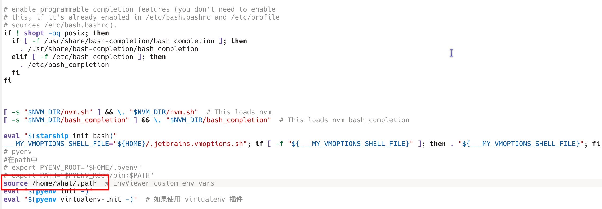
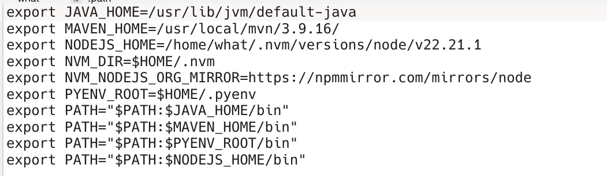
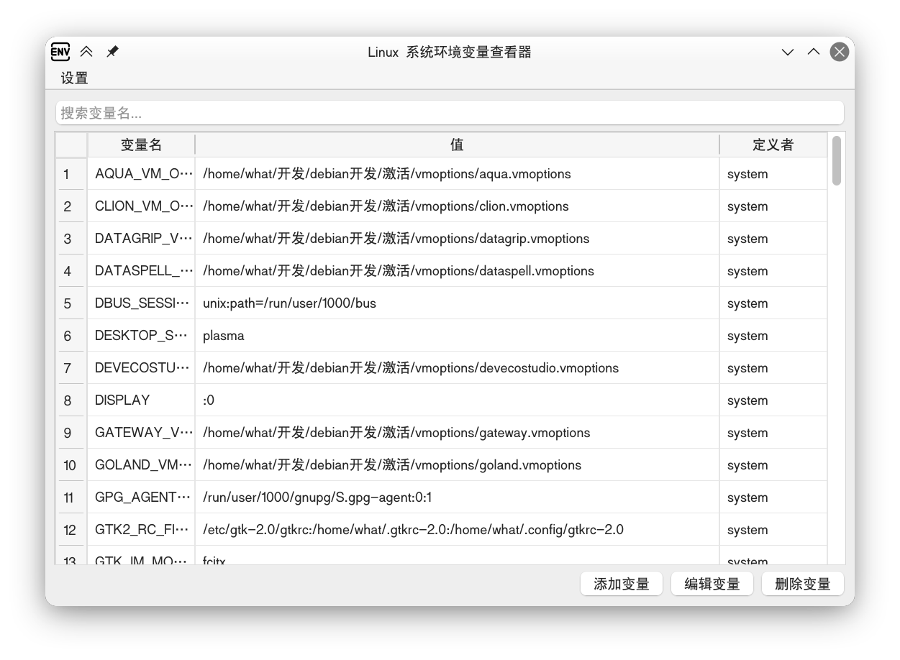
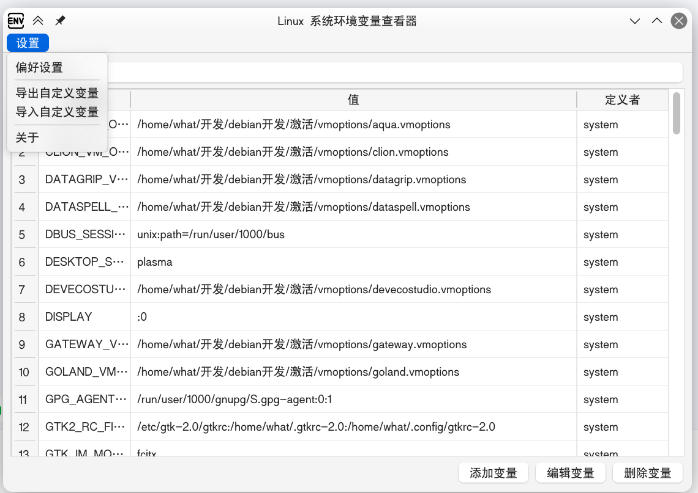
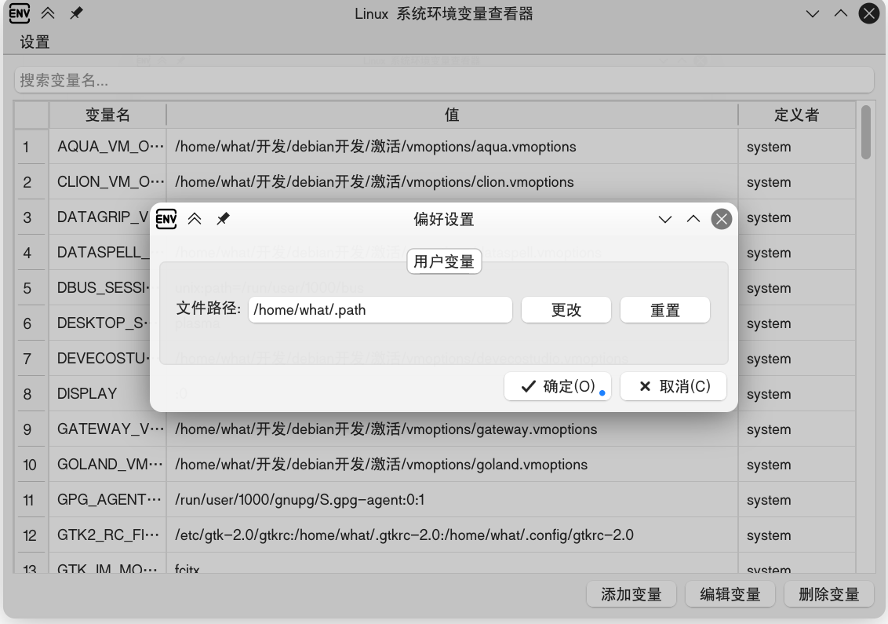
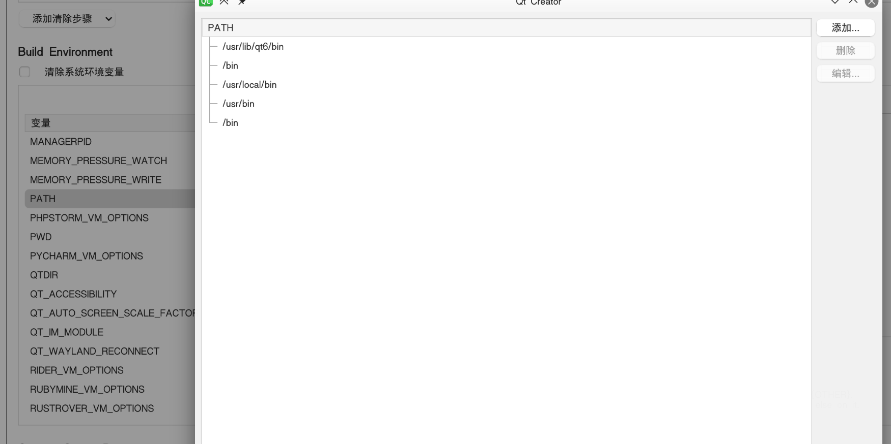

# README.md

## 介绍

本产品是一款在LInux平台上基于Qt6框架开发的环境变量编辑器，其原理是通过`.bashrc`​中再`source` 一个自定义的文件，这样写可以让自己定义的环境变量展示得更加整洁





‍

## 界面展示

- 主界面

  - 
- 设置

  - 

## 构建软件（打包）

我没有创建发行版，因为不同Linux发行版之间的Qt版本不一定相同，运行时可能存在版本不兼容的问题，所有文件都打包软件体积又太大，所以自己打包为好

- 依赖

  - qt6
  - `qtcreator`
- 构建软件包

  1. git 克隆项目
  2. 进入`src`目录
  3. 用`qtcreator`打开项目
  4. 如果项目没有没有配置，选择`Release`的配置
  5. 设置环境变量

     - 可以按要求设置环境变量，这里我推荐设置PATH的换将变量就行了（有两个bin）
     - 
- 打包

  打包有打包脚本，不用担心

  1. 用`tree`​命令检查一下`src`​的目录结构，确保可执行文件在`build/unknown-Release`目录下

     - ```bash
       envviewer/src on  main [!] via C v14.2.0-gcc 
       ❯ tree
       .
       ├── build
       │   └── unknown-Release
       │       ├── addvardialog.o
       │       ├── envviewer
       │       ├── envviewer.o
       │       ├── main.o
       │       ├── Makefile
       │       ├── moc_addvardialog.cpp
       │       ├── moc_addvardialog.o
       │       ├── moc_envviewer.cpp
       │       ├── moc_envviewer.o
       │       ├── moc_pathviewdialog.cpp
       │       ├── moc_pathviewdialog.o
       │       ├── moc_predefs.h
       │       ├── moc_preferencesdialog.cpp
       │       ├── moc_preferencesdialog.o
       │       ├── pathviewdialog.o
       │       ├── preferencesdialog.o
       │       └── ui_envviewer.h
       ├── envviewer.cpp
       ├── envviewer.h
       ├── envviewer.pro
       ├── envviewer.pro.user
       ├── envviewer.pro.user.80219c3
       ├── envviewer.ui
       ├── fuction
       │   ├── addvardialog.cpp
       │   ├── addvardialog.h
       │   ├── pathviewdialog.cpp
       │   ├── pathviewdialog.h
       │   ├── preferencesdialog.cpp
       │   └── preferencesdialog.h
       ├── head.h
       ├── main.cpp
       └── PKGBUILD
       ```
  2. 回答项目的根目录，执行脚本`deb-build.sh`

     - ```bash
       envviewer on  main [!?] 
       ❯ bash deb-build.sh
       请输入版本号:（x.x.x）:1.1.0   <-----------要输入的
       目录已经存在
       dpkg-deb: 正在 'envviwer_amd64_1.1.0.deb' 中构建软件包 'envviewer'。
       即将安装 envviwer_amd64_1.1.0.deb，是否继续？(y/n) y   <-----------要输入的
       [sudo] what 的密码：
       (正在读取数据库 ... 系统当前共安装有 473449 个文件和目录。)
       准备解压 envviwer_amd64_1.1.0.deb  ...
       正在解压 envviewer (1.1.0) 并覆盖 (1.1.0) ...
       正在设置 envviewer (1.1.0) ...
       正在处理用于 desktop-file-utils (0.28-1) 的触发器 ...
       正在处理用于 mailcap (3.74) 的触发器 ...
       正在处理用于 hicolor-icon-theme (0.18-2) 的触发器 ...
       
       ```
  3. arch的打包

     - arch打包需要执行arch-build.sh文件,脚本还须完善

‍
